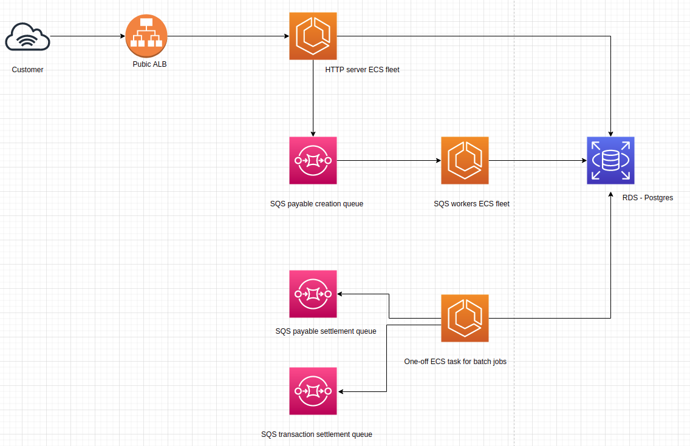

# Simple PSP

A dead simple event-driven Payment Service Provider API to illustrate how transactions are processed and how money becomes available to the merchants.

<p align="center">

</p>


## Stack

The Simple PSP project API is written in **Node.JS** and its infrastructure is built as code using **Terraform**. Here's a complete list of the tech stack used to build the entire project:

- Node.JS (Express, Sequelize, AWS SDK, Ava, Supertest )
- Terraform
- AWS (RDS, SQS, ECS Fargate, Parameter Storage, Load Balancer)
- Docker
- Docker Compose
- Postgres
- Github Actions

## Local setup

Clone the repository:

```
git clone git@github.com:0xkalvin/simple-psp.git
```

To start the application just run:

```
make
```

It will initialize the necessary infrastructure (Postgres and SQS containers) and also the PSP API itself.

## API

This section describes the resources that make up the API

### POST /transactions

#### Request

```bash
curl -XPOST "http://localhost:3000/transactions" --header "Content-Type: application/json" --header "x-customer-id: 123"  --data '{
    "description": "Lightsaber",
    "amount": "2500",
    "payment_method": "credit_card",
    "card_number": "4111111111111111",
    "card_holder_name": "Luke Skywalker",
    "card_expiration_date": "10/25",
    "card_verification_code": "123" }'
```

#### Response
201 status code
```json
{
  "id": "24e249f8-ca37-430a-afe9-bf05d9cd5688",
  "description": "Lightsaber",
  "amount": 2500,
  "payment_method": "credit_card",
  "card_holder_name": "Luke Skywalker",
  "card_expiration_date": "2025-10-01T00:00:00.000Z",
  "card_verification_code": "123",
  "card_last_four_numbers": "1111",
  "updated_at": "2020-07-19T22:26:23.693Z",
  "created_at": "2020-07-19T22:26:23.693Z"
}
```

### GET /transactions

#### Request

```bash
curl http://localhost:3000/transactions
```

#### Response
200 status code
```json
[
  {
    "id": "24e249f8-ca37-430a-afe9-bf05d9cd5688",
    "description": "Lightsaber",
    "amount": 2500,
    "payment_method": "credit_card",
    "card_holder_name": "Luke Skywalker",
    "card_expiration_date": "2025-10-01T00:00:00.000Z",
    "card_verification_code": "123",
    "card_last_four_numbers": "1111",
    "updated_at": "2020-07-19T22:26:23.693Z",
    "created_at": "2020-07-19T22:26:23.693Z"
  }
]
```

### GET /payables

#### Request

```bash
curl http://localhost:3000/payables
```

#### Response
200 status code
```json
[
  {
    "id": "4833e715-fb9b-4c60-8b8f-5bab65ea11e5",
    "status": "waiting_funds",
    "payment_date": "2020-08-18T22:26:23.693Z",
    "fee": 5,
    "receivable_amount": 2375,
    "created_at": "2020-07-19T22:26:23.701Z",
    "updated_at": "2020-07-19T22:26:23.701Z",
    "transaction_id": "24e249f8-ca37-430a-afe9-bf05d9cd5688"
  }
]
```
